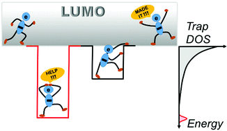

---

##### Download:

- [DOI landing page](https://doi.org/10.1039/C9TC05695E)

---

##### Abstract:

The weak intermolecular interactions inherent in organic semiconductors make them susceptible to defect formation, resulting in localized states in the band-gap that can trap charge carriers at different timescales. Charge carrier trapping is thus ubiquitous in organic semiconductors and can have a profound impact on their performance when incorporated into optoelectronic devices. This review provides a comprehensive overview on the phenomenon of charge carrier trapping in organic semiconductors, with emphasis on the underlying physical processes and its impact on device operation. We first define the concept of charge carrier trap, then outline and categorize different origins of traps. Next, we discuss their impact on the mechanism of charge transport and the performance of electronic devices. Progress in the filed in terms of characterization and detection of charge carrier traps is reviewed together with insights on future direction of research. Finally, a discussion on the exploitation of traps in memory and sensing applications is provided.

---

##### Graphical Abstract



---

##### Citation

Haneef, Hamna F., Andrew M. Zeidell, and Oana D. Jurchescu. 2020. "Charge carrier traps in organic semiconductors: a review on the underlying physics and impact on electronic devices." *Journal of Materials Chemistry C* 8: 759–787. https://doi.org/10.1039/C9TC05695E.

```BibTeX
@article{Haneef2020ChargeCarrierTraps,
author = {Haneef, Hamna F. and Zeidell, Andrew M. and Jurchescu, Oana D.},
doi = {10.1039/C9TC05695E},
journal = {Journal of Materials Chemistry C},
pages = {759--787},
title = {Charge carrier traps in organic semiconductors: a review on the underlying physics and impact on electronic devices},
volume = {8},
year = {2020}}
```

