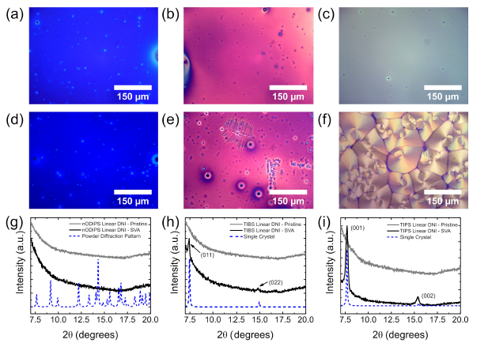

---

##### Download:

- [Paper](dinaphtho_fused_s_indacenes.pdf)
- [DOI landing page](https://doi.org/10.1021/acs.chemmater.9b01436)

---

##### Abstract:

Charge-carrier transport in thin-film organic semiconductors is strongly related to the molecular structure and the solid-state packing, which in turn are dependent on materials processing and device configurations. We report on the synthesis and characterization of a series of  (trialkylsilyl)ethynyl-substituted dinaphtho-fused s-indacenes that include three regioisomers: the linear, syn, and anti isomers. Structure–property relationships are established for these antiaromatic compounds by combining X-ray diffraction with field-effect transistor measurements and density functional theory (DFT) evaluations of the electronic band structures and intermolecular electronic couplings. High-performance, solution-processed organic thin-film transistors with charge-carrier mobilities over 7 $cm^2/(V s)$ are demonstrated upon optimization of the thin-film morphology. The DFT-derived crystal band structures provide insight into the varied performance metrics observed across the materials, though the fundamental limits of performance are not reached when the film quality is poor. The totality of the results presents the antiaromatic dinaphtho-fused s-indacenes as intriguing building blocks for molecular materials for semiconducting applications.

---

##### Figure X: Representative figure



---

##### Citation

Zeidell, Andrew M., Laura Jennings, Conerd K. Frederickson, Qianxiang Ai, Justin J. Dressler, Lev N. Zakharov, Chad Risko, Michael M. Haley, and Oana D. Jurchescu. 2019. "Organic semiconductors derived from dinaphtho-fused s-Indacenes: How molecular structure and film morphology influence thin-film transistor performance." *Chemistry of Materials* 31(17): 6962–6970. https://doi.org/10.1021/acs.chemmater.9b01436.

```BibTeX
@article{Zeidell2019DinaphthoFused,
author = {Zeidell, Andrew M. and Jennings, Laura and Frederickson, Conerd K. and Ai, Qianxiang and Dressler, Justin J. and Zakharov, Lev N. and Risko, Chad and Haley, Michael M. and Jurchescu, Oana D.},
doi = {10.1021/acs.chemmater.9b01436},
journal = {Chemistry of Materials},
number = {17},
pages = {6962--6970},
title = {Organic semiconductors derived from dinaphtho-fused s-Indacenes: How molecular structure and film morphology influence thin-film transistor performance},
volume = {31},
year = {2019}}
```
