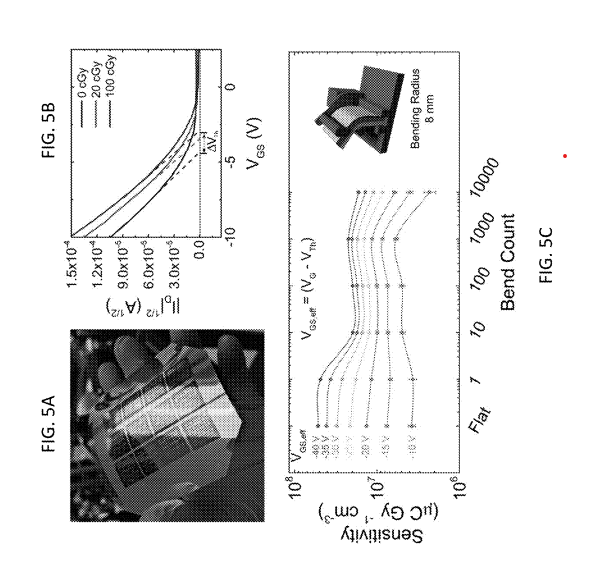

---

##### Download:

- [Patent](US12194314.pdf)

---

##### Abstract:

In one aspect, radiation dosimeters are described herein comprising organic field effect transistors. Briefly, a radiation dosimeter comprises an organic field effect transistor having composition and/or electronic structure exhibiting a shift in threshold voltage as a function of radiation dose.

---

##### Figure 5:  Representative Figure



---

##### Citation

A Zeidell, OD Jurchescu, JD Bourland, T Ren - US Patent 12,194,314, 2025. https://patents.google.com/patent/US12194314B2/en.

```BibTeX
@patent{Zeidell2024,
  author    = {Zeidell, Andrew and others},
  title     = {Flexible transistor-based devices for radiation dosimetry and related methods},
  number    = {US12194314B2},
  year      = {2024},
  type      = {US Patent},
  url       = {https://patents.google.com/patent/US12194314B2/en}
}
```

