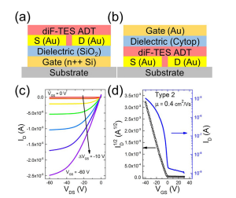

---

##### Download:

- [Paper](field_dependent_charge_transport.pdf)
- [DOI landing page](https://doi.org/10.1063/1.5099388)

---

##### Abstract:

Organic semiconductors are highly susceptible to defect formation, leading to electronic states in the gap—traps—which typically reduce the performance and stability of devices. To study these effects, we tuned the degree of charge trapping in organic thin-film transistors by modifying the film deposition procedures and device structure. The resulting charge carrier mobility varied between $10^(−3)$ and $10 cm^2/Vs$ in 2,8-difluoro-5,11-bis(triethylsilylethynyl)anthradithiophene. We analyzed the data using a Poole-Frenkel-like model and found a strong dependence of mobility on the field in low-mobility transistors and a field-independent mobility in high-performance devices. We confirmed the presence of traps in all films investigated in this study and concluded that the Poole-Frenkel model is not sufficiently sensitive to identify traps when their concentration is below the detection limit.

---

##### Figure X: Representative figure



---

##### Citation

Anand, Sajant, Katelyn P. Goetz, Zachary A. Lamport, Andrew M. Zeidell, and Oana D. Jurchescu. 2019. "Field-dependent charge transport in organic thin-film transistors: Impact of device structure and organic semiconductor microstructure." *Applied Physics Letters* 115: 073301. https://doi.org/10.1063/1.5099388.

```BibTeX
@article{Anand2019FieldDependent,
author = {Anand, Sajant and Goetz, Katelyn P. and Lamport, Zachary A. and Zeidell, Andrew M. and Jurchescu, Oana D.},
doi = {10.1063/1.5099388},
journal = {Applied Physics Letters},
pages = {073301},
title = {Field-dependent charge transport in organic thin-film transistors: Impact of device structure and organic semiconductor microstructure},
volume = {115},
year = {2019}}
```
