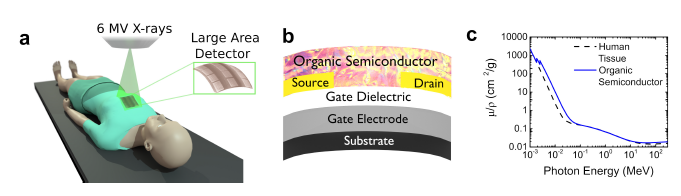

---

##### Download:

- [Paper](organic_fet_radiation_dosimeters.pdf)
- [DOI landing page](https://doi.org/10.1002/advs.202001522)

---

##### Abstract:

Radiation therapy is one of the most prevalent procedures for cancer treatment, but the risks of malignancies induced by peripheral beam in healthy tissues surrounding the target is high. Therefore, being able to accurately measure the exposure dose is a critical aspect of patient care. Here a radiation detector based on an organic field-effect transistor (RAD-OFET) is introduced, an in vivo dosimeter that can be placed directly on a patient's skin to validate in real time the dose being delivered and ensure that for nearby regions an acceptable level of low dose is being received. This device reduces the errors faced by current technologies in approximating the dose profile in a patient's body, is sensitive for doses relevant to radiation treatment procedures, and robust when incorporated into conformal large-area electronics. A model is proposed to describe the operation of RAD-OFETs, based on the interplay between charge photogeneration and trapping.

---

##### Figure X: Representative figure



---

##### Citation

Zeidell, Andrew M., Tong Ren, David S. Filston, Hamna F. Iqbal, Emma Holland, J. Daniel Bourland, John E. Anthony, and Oana D. Jurchescu. 2020. "Organic Field-Effect Transistors as Flexible, Tissue-Equivalent Radiation Dosimeters in Medical Applications." *Advanced Science* 7(18): 2001522. https://doi.org/10.1002/advs.202001522.

```BibTeX
@article{Zeidell2020Dosimeters,
author = {Zeidell, Andrew M. and Ren, Tong and Filston, David S. and Iqbal, Hamna F. and Holland, Emma and Bourland, J. Daniel and Anthony, John E. and Jurchescu, Oana D.},
doi = {10.1002/advs.202001522},
journal = {Advanced Science},
number = {18},
pages = {2001522},
title = {Organic Field-Effect Transistors as Flexible, Tissue-Equivalent Radiation Dosimeters in Medical Applications},
volume = {7},
year = {2020}}
```
