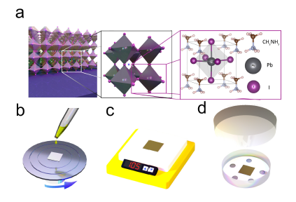

---

##### Download:

- [Paper](enhanced_charge_transport_perovskite_fets.pdf)
- [DOI landing page](https://doi.org/10.1002/aelm.201800316)

---

##### Abstract:

Hybrid organic–inorganic perovskites have recently gained immense attention due to their unique optical and electronic properties and low production cost, which make them promising candidates for a wide range of optoelectronic devices. But unlike most other technologies, the breakthroughs witnessed in hybrid perovskite optoelectronics have outgrown the basic understanding of the fundamental material properties. For example, the effectiveness of charge transport in relation to film microstructure and processing has remained elusive. In this study, field-effect transistors are fabricated and evaluated in order to probe the nature and dynamics of charge transport in thin films of methylammonium lead iodide. A dramatic improvement is shown in the electrical properties upon solvent vapor annealing. The resulting devices exhibit ambipolar transport, with room-temperature hole and electron mobilities exceeding 10 cm2 V−1 s−1. The remarkable enhancement in charge carrier mobility is attributed to the increase in the grain size and passivation of grain boundaries via the formation of solvent complexes.

---

##### Figure X: Representative figure



---

##### Citation

Zeidell, Andrew M., Colin Tyznik, Laura Jennings, Chuang Zhang, Hyunsu Lee, Martin Guthold, Z. Valy Vardeny, and Oana D. Jurchescu. 2018. "Enhanced charge transport in hybrid perovskite field-effect transistors via microstructure control." *Advanced Electronic Materials* 4: 1800316. https://doi.org/10.1002/aelm.201800316.

```BibTeX
@article{Zeidell2018PerovskiteFET,
author = {Zeidell, Andrew M. and Tyznik, Colin and Jennings, Laura and Zhang, Chuang and Lee, Hyunsu and Guthold, Martin and Vardeny, Z. Valy and Jurchescu, Oana D.},
doi = {10.1002/aelm.201800316},
journal = {Advanced Electronic Materials},
pages = {1800316},
title = {Enhanced charge transport in hybrid perovskite field-effect transistors via microstructure control},
volume = {4},
year = {2018}}
```
