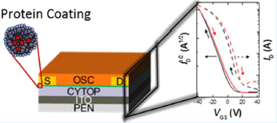

---

##### Download:
- [Paper](Ward_et_al_2017.pdf)
- [DOI landing page](https://doi.org/10.1021/acsami.7b03232)

---

##### Abstract:

Solution-processable electronic devices are highly desirable due to their low cost and compatibility with flexible substrates. However, they are often challenging to fabricate due to the hydrophobic nature of the surfaces of the constituent layers. Here, we use a protein solution to modify the surface properties and to improve the wettability of the fluoropolymer dielectric Cytop. The engineered hydrophilic surface is successfully incorporated in bottom-gate solution-deposited organic field-effect transistors (OFETs) and hybrid organic–inorganic trihalide perovskite field-effect transistors (HTP-FETs) fabricated on flexible substrates. Our analysis of the density of trapping states at the semiconductor–dielectric interface suggests that the increase in the trap density as a result of the chemical treatment is minimal. As a result, the devices exhibit good charge carrier mobilities, near-zero threshold voltages, and low electrical hysteresis.

---

##### Graphical Abstract



---

##### Citation

Jeremy W. Ward, Hannah L. Smith, Andrew Zeidell, Peter J. Diemer, Stephen R. Baker, Hyunsu Lee, Marcia M. Payne, John E. Anthony, Martin Guthold, and Oana D. Jurchescu. 2017. "Solution-Processed Organic and Halide Perovskite Transistors on Hydrophobic Surfaces." *ACS Applied Materials & Interfaces* 9 (21): 18120-18126. https://doi.org/10.1021/acsami.7b03232.

```BibTeX
@article{Ward2017PerovskiteCytop,
author = {Ward, Jeremy W. and Smith, Hannah L. and Zeidell, Andrew and Diemer, Peter J. and Baker, Stephen R. and Lee, Hyunsu and Payne, Marcia M. and Anthony, John E. and Guthold, Martin and Jurchescu, Oana D.},
title = {Solution-Processed Organic and Halide Perovskite Transistors on Hydrophobic Surfaces},
journal = {ACS Applied Materials \& Interfaces},
volume = {9},
number = {21},
pages = {18120-18126},
year = {2017},
doi = {10.1021/acsami.7b03232},
    note ={PMID: 28485580},
URL = {https://doi.org/10.1021/acsami.7b03232},
eprint = {https://doi.org/10.1021/acsami.7b03232}}
```
