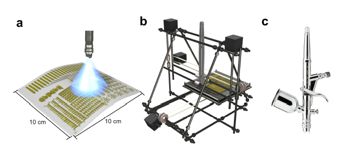

---

##### Download:

- [Paper](large_area_polymer_transistor_arrays.pdf)
- [DOI landing page](https://doi.org/10.1002/admt.202000390)

---

##### Abstract:

Solution-processable organic semiconductors can serve as the basis for new products including rollable displays, tattoo-like smart bandages for real-time health monitoring, and conformable electronics integrated into clothing or even implanted in the human body. For such exciting commercial applications to become a reality, good device performance and uniformity over large areas are necessary. The design of new materials has progressed at an astonishing pace, but accessing their intrinsic, efficient electrical properties in large-area flexible device arrays is difficult. The development of protocols that allow integration with industrial-scale processing for high-throughput manufacturing, without the need to compromise on performance, is the key for transitioning these materials to real-life applications. In this work, large-area arrays of organic thin-film transistors obtained by spray-coating the high-mobility polymer indacenodithiophene-co-benzothiadiazole (IDTBT) are demonstrated. A maximum charge carrier mobility of $2.3 cm^2 V^−1 s^−1$, with a very narrow performance distribution, is obtained over surface areas of 10 cm × 10 cm. The devices retain their electrical properties when bent multiple times and at different curvatures. In addition, large arrays of highly sensitive (0.25% change in mobility for 1% humidity variation), reusable, near-identical humidity sensors are produced in a one-step fabrication and calibrated from 0% to 94% relative humidity.

---

##### Figure 1: Representative figure



---

##### Citation

Zeidell, Andrew M., David S. Filston, Matthew Waldrip, Hamna F. Iqbal, Hu Chen, Iain McCulloch, and Oana D. Jurchescu. 2020. "Large-Area Uniform Polymer Transistor Arrays on Flexible Substrates: Towards High-Throughput Sensor Fabrication." *Advanced Materials Technologies* 5(8): 2000390. https://doi.org/10.1002/admt.202000390.

```BibTeX
@article{Zeidell2020LargeArea,
author = {Zeidell, Andrew M. and Filston, David S. and Waldrip, Matthew and Iqbal, Hamna F. and Chen, Hu and McCulloch, Iain and Jurchescu, Oana D.},
doi = {10.1002/admt.202000390},
journal = {Advanced Materials Technologies},
number = {8},
pages = {2000390},
title = {Large-Area Uniform Polymer Transistor Arrays on Flexible Substrates: Towards High-Throughput Sensor Fabrication},
volume = {5},
year = {2020}}
```
