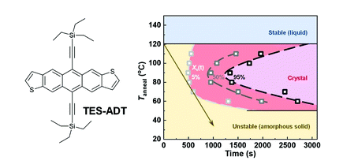

---

##### Download:

- [Paper](isothermal_crystallization_tes_adt.pdf)
- [DOI landing page](https://doi.org/10.1039/D1TC01482J)

---

##### Abstract:

Thermal annealing of organic semiconductors is critical for optimization of their electronic properties. The selection of the optimal annealing temperature –often done on a trial-and-error basis– is essential for achieving the most desired micro/nanostructure. While classical materials science relies on time-temperature-transformation (TTT) diagrams to predict such processing-structure relationships, this type of approach is yet to find widespread application in the field of organic electronics. In this work, we constructed a TTT diagram for crystallization of the widely studied organic semiconductor 5,11-bis(triethylsilylethynyl)anthradithiophene (TES-ADT) from its melt. Thermal analysis in the form of isothermal crystallization experiments showed distinctly different types of behaviour depending on the annealing temperature, in agreement with classical crystal nucleation and growth theory. Hence, the TTT diagram correlates with the observed variation in the number of crystal domains, the crystal coverage and film texture as well as the obtained polymorph. As a result, we are able to rationalize the influence of the annealing temperature on the charge-carrier mobility extracted from field-effect transistor (FET) measurements. Evidently, the use of TTT diagrams is a powerful tool to describe structure formation of organic semiconductors and can be used to predict processing protocols that lead to optimal device performance.

---

##### Figure X: Representative figure



---

##### Citation

Yu, Liyang, Andrew M. Zeidell, John E. Anthony, Oana D. Jurchescu, and Christian Müller. 2021. "Isothermal crystallization and time-temperature-transformation diagram of the organic semiconductor 5,11-bis(triethylsilylethynyl)anthradithiophene." *Journal of Materials Chemistry C* 9: 11745. https://doi.org/10.1039/D1TC01482J.

```BibTeX
@article{Yu2021TESADT,
author = {Yu, Liyang and Zeidell, Andrew M. and Anthony, John E. and Jurchescu, Oana D. and M{"u}ller, Christian},
doi = {10.1039/D1TC01482J},
journal = {Journal of Materials Chemistry C},
pages = {11745},
title = {Isothermal crystallization and time-temperature-transformation diagram of the organic semiconductor 5,11-bis(triethylsilylethynyl)anthradithiophene},
volume = {9},
year = {2021}}
```
